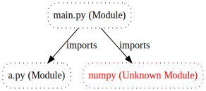
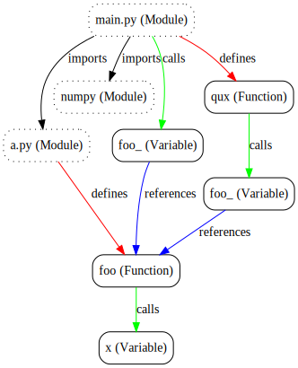

# Quick usage examples

## Parse trees

Semantic uses [tree-sitter](https://github.com/tree-sitter/tree-sitter) to generate parse trees, but layers in a more generalized notion of syntax terms across all supported programming languages. We'll see why this is important when we get to diffs and program analysis, but for now let's just inspect some output. It helps to have a simple program to parse, so let's create one. Open a file `test.A.py` and paste in the following:

``` python
def Foo(x):
    return x
print Foo("hi")
```

Now, let's generate an abstract syntax tree (AST).

``` bash
$ semantic parse test.A.py
(Statements
  (Annotation
    (Function
      (Identifier)
      (Identifier)
      (Return
        (Identifier)))
    (Empty))
  (Call
    (Identifier)
    (Call
      (Identifier)
      (TextElement)
      (Empty))
    (Empty)))
```

The default s-expression output is a good format for quickly visualizing the structure of code. We can see that there is a function declared and that then there is a call expression, nested in another call expression which matches the function calls to `print` and `Foo`. Feel free to play with some of the other output formats, for example the following will give back the same AST, but in JSON and with much more information about each node including things like the span and range of each syntactic element in the original source file.

``` bash
$ semantic parse --json test.A.py
```

## Diffs

Now, let's look at a simple, syntax aware diff. Create a second file `test.B.py` that looks like this (The function `Foo` has been renamed).

``` python
def Bar(x):
    return x
print Bar("hi")
```

First, let's just see what the diff looks like.

``` bash
$ git diff --no-index test.A.py test.B.py
```
``` diff
diff --git a/test.A.py b/test.B.py
index 81f210023..5f37f4260 100644
--- a/test.A.py
+++ b/test.B.py
@@ -1,3 +1,3 @@
-def Foo(x):
+def Bar(x):
     return x
-print Foo("hi")
+print Bar("hi")
```

Now, let's look at a syntax aware diff.

``` bash
$ semantic diff test.A.py test.B.py
(Statements
  (Annotation
    (Function
    { (Identifier)
    ->(Identifier) }
      (Identifier)
      (Return
        (Identifier)))
    (Empty))
  (Call
    (Identifier)
    (Call
    { (Identifier)
    ->(Identifier) }
      (TextElement)
      (Empty))
    (Empty)))
```

Notice the difference? Instead of showing that entire lines were added and removed, the semantic diff is aware that the identifier of the function declaration and function call changed. Pretty cool.

## Import graphs

OK, now for the fun stuff. Semantic can currently produce a couple of different graph-based views of source code, let's first take a look at import graphs. An import graph shows how files include other files within a software project. For this example, we are going to write a little bit more code in order to see this work. Start by creating a couple of new files:

``` python
# main.py
import numpy as np
from a import foo as foo_

def qux():
    return foo_()

foo_(1)
```

``` python
# a.py
def foo(x):
    return x
```

Now, let's graph.

``` bash
$ semantic graph main.py
digraph
{

  "a.py (Module)" [style="dotted, rounded" shape="box"]
  "main.py (Module)" [style="dotted, rounded" shape="box"]
  "numpy (Unknown Module)" [style="dotted, rounded" shape="box" color="red" fontcolor="red"]
  "main.py (Module)" -> "a.py (Module)" [len="5.0" label="imports"]
  "main.py (Module)" -> "numpy (Unknown Module)" [len="5.0" label="imports"]
}
```

To make this easier to visualize, let's use the `dot` utility from `graphviz` and write this graph to SVG:

```
$ semantic graph main.py | dot -Tsvg > main.html && open main.html
```

You'll get something that looks like this:



## Call graphs

Call graphs expand on the import graphing capabilities by adding in some additional vertices and edges to the graph to identify named symbols and the connections between them. Taking the same example code, simply add `--call` to the invocation of semantic:

```
$ semantic graph --calls main.py | dot -Tsvg > main.html && open main.html
```


